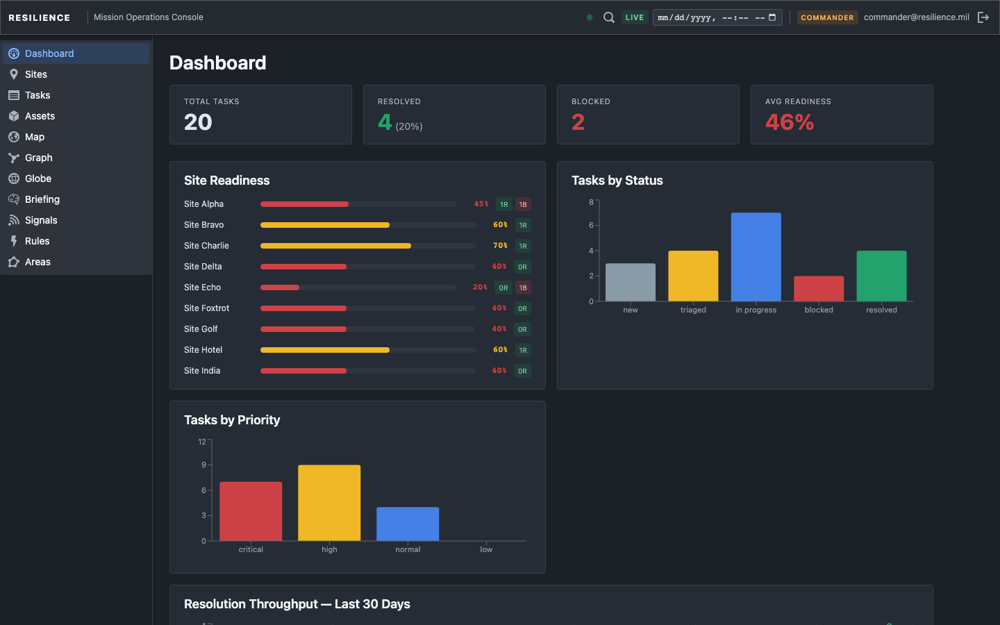
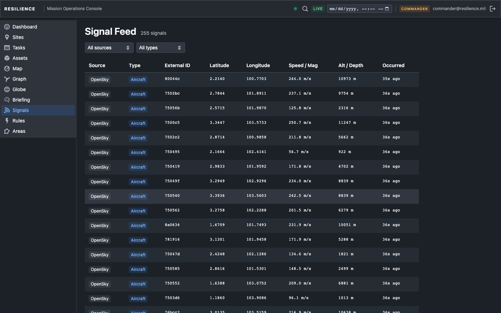
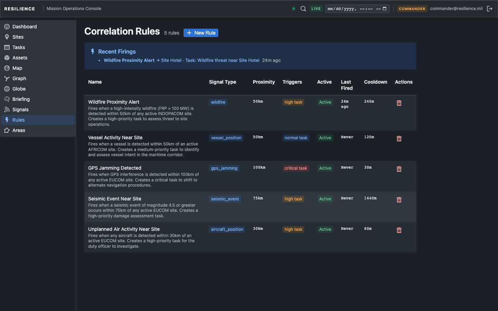
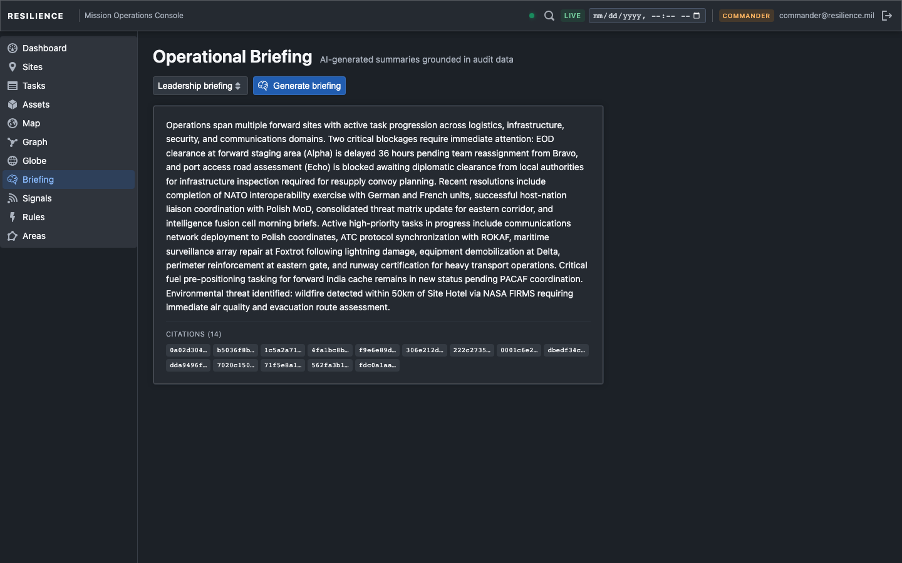
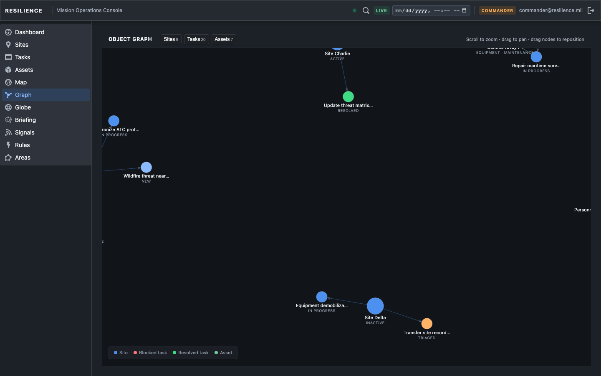

# Resilience

[](https://github.com/TimurMishiev/resilience/actions)
[](#test-coverage)
[](#test-coverage)
[](#test-coverage)
[](#security)
[](frontend/tsconfig.app.json)
[](LICENSE)

**Operational intelligence platform for monitoring distributed field operations, fusing multi-source intelligence, and coordinating tactical response in real time.**

Resilience is the kind of software that runs inside a TOC (Tactical Operations Center). It ingests live sensor feeds, correlates threat patterns, fuses alerts into incidents, and gives operators a single operational picture across 2D map, 3D globe, and structured data surfaces. Every mutation is audit-logged transactionally. Every surface supports time-travel replay. The authorization model enforces organization and area-of-operation boundaries at every layer.

Built as a portfolio project targeting defense-tech engineering roles (Palantir, Anduril, Reveal Technology, Shield AI). The codebase is production-hardened: **a large backend RSpec suite spanning 192 spec files, 815 frontend tests across 105 files, and 55 Playwright tests across 15 spec files**, with Pundit authorization on every endpoint and CI that gates on security scanning, type safety, and performance budgets before auto-deploying. Installable as a PWA with offline caching. Classification banner support (UNCLASSIFIED / CUI / SECRET).

**Read the design thesis: [Provenance is one invariant](docs/audit-replay-validator-thesis.md)** — a ~2,000-word essay arguing that the audit chain, the replay projection, and the LLM trust boundary are the same idea applied at three layers. The repo is the example; the thesis is the argument.

**Live:** [https://resilience-ops.fly.dev](https://resilience-ops.fly.dev)

| Role | Email | Password |
|------|-------|----------|
| Commander | commander@resilience.mil | password123 |
| Operator | operator@resilience.mil | password123 |
| Viewer | viewer@resilience.mil | password123 |

---

## Start Here

- **Want the guided live walkthrough?** Read [docs/demo-guide.md](docs/demo-guide.md).
- **Want the fastest code review path?** Start with the [Reviewer's Guide](#reviewers-guide--if-you-only-have-10-minutes) below, then [PORTFOLIO.md](PORTFOLIO.md).
- **Want to run it locally?** Use [Quick Start (Docker)](#quick-start-docker) below, then [CONTRIBUTING.md](CONTRIBUTING.md) for full dev setup.
- **Want design rationale?** Read the ADRs in [docs/](docs/).
- **Public reviewer docs:** `README.md`, `PORTFOLIO.md`, `CONTRIBUTING.md`, `SECURITY.md`, and `docs/`.
- **Internal execution docs:** `memory/` is the repo's AI-assisted handoff and planning area. It is not required to evaluate, demo, or run the product.

---

## Reviewer's Guide — If You Only Have 10 Minutes

Busy? Open these five files. Each one is deliberately chosen to demonstrate a distinct staff-level property of the system, not just "some representative code."

1. **Audit trail with chain-of-custody** — [`backend/app/services/audit/event_writer.rb`](backend/app/services/audit/event_writer.rb) + [`chain_hasher.rb`](backend/app/services/audit/chain_hasher.rb) + [`chain_verifier.rb`](backend/app/services/audit/chain_verifier.rb)
   Every mutation writes `before_snapshot` / `after_snapshot` through `EventWriter` **inside the same database transaction** as the mutation itself, and every row is hash-chained per organization with DB-level immutability triggers ([ADR-010](docs/adr-010-audit-chain-of-custody.md)). Tampering survives Ruby readonly → fails on the trigger. Trigger drop survives → fails on the chain. A daily scheduled job + admin-only on-demand endpoint walk every chain and report the exact `chain_position` of any break. Architectural commitment, not a logging afterthought.

2. **Atomic cooldown under concurrency** — [`backend/app/services/correlations/rule_firing_service.rb`](backend/app/services/correlations/rule_firing_service.rb)
   Correlation-rule cooldowns use `UPDATE ... WHERE last_fired_at <= ?` with `update_all`. If `rows_updated == 0`, the claim lost; another worker already fired. Exactly-once semantics via row lock, not via distributed lock or idempotency key. The paired spec — [`rule_firing_service_spec.rb`](backend/spec/services/correlations/rule_firing_service_spec.rb) — proves the concurrency invariant, not just the happy path.

3. **Multi-tenant authorization with named helpers** — [`backend/app/policies/application_policy.rb`](backend/app/policies/application_policy.rb)
   Notice the helper pair `owned_area_of_operation_accessible?` vs `area_of_operation_surface_accessible?`. The first hides org-null global AOs; the second exposes them. Every Pundit policy uses a **named** helper, never the raw flag. This is the anti-pattern to the "let's just check `organization_id`" sprawl that multi-tenant systems accrete. 32 policies, one discipline, enforced by `verify_authorized` after-action.

4. **AI trust boundary** — [`backend/app/services/recommendations/validator.rb`](backend/app/services/recommendations/validator.rb)
   LLM-produced recommendations run four checks before persistence: (1) surfaced entity exists, (2) each evidence item exists, (3) action-payload IDs exist, (4) payload IDs refer to the *same* entity as the surfaced entity. Check 4 is the one that matters — it prevents the model from displaying "Incident A" in the UI while carrying "Incident B" in the executable payload. LLM output is treated as untrusted input, same posture as user input.

5. **Server-side replay engine** — [`docs/adr-001-server-side-replay.md`](docs/adr-001-server-side-replay.md) → [`backend/app/services/replay/projection_service.rb`](backend/app/services/replay/projection_service.rb)
   `as_of` is a first-class query parameter that reconstructs entity state at any past timestamp by replaying the audit log. Single-query projection via `DISTINCT ON (entity_id)` ordered by `occurred_at DESC, id DESC`; entities absent from the pre-`as_of` audit window are excluded (they did not yet exist). Explicit "pure read operation, no side effects" contract. Read the ADR first for the design rationale, then the service for the implementation.

Each file is worth ~2 minutes. If only one: pick #3 (authorization helpers) — it's the single cleanest demonstration of disciplined production code on a topic where most platforms get sloppy.

**Want more?** See [`PORTFOLIO.md`](PORTFOLIO.md) for tiered 5/15/30/60-minute
evaluator tours, honest weaknesses, and interview conversation openers. See
[`CHANGELOG.md`](CHANGELOG.md) for the phase-level shipping arc.

---

## Quick Start (Docker)

```bash
git clone https://github.com/TimurMishiev/resilience.git
cd resilience
docker compose up
```

Open **http://localhost:3000**. Demo data (9 sites, 19 tasks, 7 signal types, vessels, incidents, correlation rules) is seeded automatically on first run.

Need a walkthrough after boot? See [docs/demo-guide.md](docs/demo-guide.md).

> **AI features** require an Anthropic API key:
> ```bash
> ANTHROPIC_API_KEY=sk-ant-... docker compose up
> ```

> **Stopping:** `Ctrl+C`, then `docker compose down`. Add `-v` to reset all data.

---

## Architecture

```
                          ┌──────────────────────────────────────────────┐
                          │            Frontend  (React 19 / TS)        │
                          │  26 pages  ·  80 components  ·  64 hooks   │
                          │  Blueprint.js  ·  MapLibre GL  ·  CesiumJS │
                          └────────────────────┬─────────────────────────┘
                                               │  REST  +  SSE
                          ┌────────────────────▼─────────────────────────┐
                          │           Backend  (Rails 8 API)             │
                          │  30 models  ·  32 policies  ·  75 services  │
                          │  39 controllers  ·  16 jobs  ·  79 migrations│
                          └──┬──────────────────┬───────────────────┬────┘
                             │                  │                   │
               ┌─────────────▼──────┐  ┌───────▼────────┐  ┌──────▼──────────┐
               │  PostgreSQL 17     │  │  SolidQueue    │  │  SSE Broadcaster │
               │  + PostGIS         │  │  20 recurring  │  │  PG LISTEN/      │
               │  UUID PKs          │  │  jobs          │  │  NOTIFY relay    │
               │  structure.sql     │  │                │  │                  │
               └────────────────────┘  └────────────────┘  └──────────────────┘
```

### Signal-to-Action Pipeline

```
External Feeds (7)              Correlation Engine              Operator Workflow
─────────────────     ────────────────────────────     ───────────────────────────
USGS seismic     ─┐                                    ┌─ Alert triage (4-state)
OpenSky aircraft ─┤   ExternalSignal                   ├─ Incident fusion
AISHub vessels   ─┤     │                              ├─ Kill-chain prosecution
NASA FIRMS fire  ─┼───► │ ── Rules (simple/compound) ─┼─ Task assignment
GPSJam jamming   ─┤     │       │                      ├─ AI recommendations
GDACS disasters  ─┤     │       └── Confidence scoring ├─ Operator notes (append-only)
ACLED conflict   ─┘     │                              └─ Full audit trail
                        └── Vessel upsert / gap / loiter
```

1. **Ingest** -- SolidQueue polls 7 feeds on independent schedules (30s to 1h). Each signal is stored as an `ExternalSignal` with type, coordinates, magnitude, and raw payload.
2. **Correlate** -- Every 30 seconds, `Correlations::EvaluateRecentJob` runs all active rules against recent signals. Rules support single conditions, compound AND/OR across signal types, proximity thresholds, and magnitude floors. Cooldown is claimed atomically (`UPDATE ... WHERE last_fired_at <= ?`) so concurrent workers cannot double-fire.
3. **Fuse** -- `FusionService` groups related alerts into incidents. `RuleFiringService` computes confidence scores (proximity + freshness + corroboration). Geofence breaches are detected independently.
4. **Act** -- Operators triage alerts through a 4-state machine (unacknowledged -> acknowledged -> investigating -> closed), work incidents in a 5-tab workspace, and execute AI-generated recommendations that have been validated against real entity references.
5. **Broadcast** -- Every state change fires an SSE event via PostgreSQL `LISTEN`/`NOTIFY` relay. All connected clients update without polling.

---

## Domain Model

| Entity | Purpose |
|--------|---------|
| **Organization** | Tenant boundary. All operational data is org-scoped. |
| **AreaOfOperation** | Geographic polygon with threat posture. Scopes correlation rules, doctrine, and operational data. Org-null AOs are global intelligence overlays. |
| **Site** | Monitored location with status, geofence, readiness score, and risk level. |
| **Asset** | Deployable resource (UAV, sensor, vehicle) with live telemetry stream. |
| **ExternalSignal** | Raw inbound intelligence from any of 7 feed types. |
| **Vessel** | First-class AIS entity with track history, gap detection, and loitering analysis. |
| **CorrelationRule** | Threat pattern matcher -- simple or compound AND/OR conditions with MITRE ATT&CK tagging. |
| **SignalRuleMatch** | Alert -- links signal, rule, and site with confidence score and 4-state workflow. |
| **Incident** | Fused operational event grouping related alerts, with prosecution phases (assessing -> executing -> concluded). |
| **Task** | Actionable work item with priority and 5-state workflow (new -> triaged -> in_progress -> blocked -> resolved). |
| **Recommendation** | AI-generated action with entity-validated evidence chain and accept/reject/defer/execute lifecycle. |
| **AuditEvent** | Immutable before/after snapshot written transactionally with every mutation. |
| **CommanderIntent / PacePlan / SaluteReport / Chokepoint** | Doctrine entities scoped to areas of operation. |

---

## Authorization Model

Four roles with server-enforced Pundit policies on every endpoint:

| Capability | Viewer | Operator | Commander | Admin |
|-----------|--------|----------|-----------|-------|
| Read operational data | Y | Y | Y | Y |
| Task transitions | -- | Own tasks | All tasks | All tasks |
| Alert triage | -- | Y | Y | Y |
| Incident management | -- | Assigned | All | All |
| Create rules / inject signals | -- | -- | Y | Y |
| AI briefing / ontology query | -- | -- | Y | Y |
| Planning doctrine (PACE, intent) | -- | -- | Y | Y |
| Manage users / orgs / sessions | -- | -- | -- | Y |

**Tenant isolation:** Organizations see only their own data. Areas of operation further narrow access for AO-pinned users. Global intelligence domains (signals, vessels) are shared. Doctrine attached to org-null global AOs is hidden from org-scoped users. 30 Pundit policies enforce these boundaries, proven by dedicated org-isolation and scoped-access request specs.

---

## Operational Surfaces

### Dashboard
KPI row (tasks, resolved rate, blocked count, avg readiness), per-site readiness bars with risk badges (LOW/MOD/HIGH/CRIT backed by composite scoring: alert pressure + task health + signal density), 30-day resolution throughput, recent alerts, AI recommendations, and a live loitering watchlist.

### Map (MapLibre GL)
2D operational map rendering sites (risk-colored), assets (status-colored with sensor coverage circles), all 7 signal types, AO polygons (posture-colored), chokepoint overlays (status-colored), geofence breach pulse rings, heatmap density layer, and selected-vessel track trails. Style switcher (tactical/satellite/street). Click any entity for an inline detail panel with live data and task transitions.

### Globe (CesiumJS)
3D globe with the same operational data. Sites, assets with live telemetry, signals, AO polygons, chokepoints, coverage circles, breach rings, and vessel tracks. Deep-link selection state shared with the map (`?site_id=`, `?asset_id=`, `?signal_id=`). No Cesium Ion account required.

### Incidents
Inbox sorted by severity with color-coded borders. Filter by status or "Mine" for assigned incidents. Take/Drop ownership inline.

### Incident Detail
5-tab workspace: Evidence (contributing alerts), Tasks (spawned work), Recommendations (AI-generated with evidence drawer), Notes (append-only operational log), History (full audit trail). Kill-chain prosecution workflow with phase tracking (assessing -> executing -> concluded) and append-only prosecution steps with evidence references.

### Signal Feed
Infinite-scroll virtualized table (~25 DOM nodes at any scroll position) showing all ingested signals. Commanders can inject synthetic signals that run the full correlation engine immediately.

### Correlation Rules
Builder for simple and compound (AND/OR) rules with proximity, magnitude, and signal-type conditions. Scoped to AOs. Dry-run against historical signals. 6 one-click templates (Maritime Deception, EW Precursor, etc.). MITRE ATT&CK technique tagging. Effectiveness analytics.

### Alert Triage
Virtualized alert inbox with bulk actions, filtering by status/priority/AO, and inline state transitions. Confidence scores displayed per alert.

### Planning
Unified doctrine surface: SALUTE reports, PACE plans, commander intent, and chokepoints in a single tabbed view scoped to the user's areas of operation.

### AI Briefing
Natural-language operational summary for any site or all sites. Grounded in real audit events, nearby signals (200km/72h), and recent rule fires. Every entity reference the model cites is validated against actual records -- hallucinated IDs are stripped before reaching the UI. Requires Anthropic API key.

### Ontology Query
Commander-only natural-language graph query. Translates a root entity + relation focus into a bounded traversal over the incident/site/task/asset/area graph using Anthropic tool-use. Returns normalized nodes, edges, and counts.

### Replay
Time-travel to any past timestamp. Sites, tasks, alerts, incidents, readiness scores, risk snapshots, doctrine, AO overlays, chokepoint overlays, breach rings, vessel context, recommendations, and audit events all reconstruct historical state. Live-only surfaces (throughput analytics, loitering watchlist, operational health, mutation affordances) are explicitly gated off during replay.

### Other Surfaces
- **Sites** -- table with readiness, risk, status. **Site Detail** -- 6 tabs: tasks, signals, rule fires, assets, audit trail, timeline.
- **Graph** -- D3 force-directed ontology graph (site -> task -> asset dependency chain).
- **Areas of Operation** -- GeoJSON polygon input with threat posture levels, rendered on map and globe.
- **Swimlane** -- per-site event lane visualization backed by `Analytics::SwimlaneService`.
- **Operational Health** -- commander-only dashboard of feed health, job status, and relay liveness snapshots.
- **Security** -- session inventory with per-session revocation and bulk "sign out all devices".
- **Users / Organizations** -- admin-only management surfaces.
- **Command palette** (Cmd+K) -- global search across sites, tasks, and assets.
- **Batch export** -- CSV/JSON export with per-page filter passthrough for signals, alerts, tasks, incidents, sites, and audit events. Global export dialog + per-page export buttons.
- **Offline detection** -- disables mutations and shows reconnection banner on connectivity loss.

---

## Real-Time Architecture

SSE (Server-Sent Events) with PostgreSQL `LISTEN`/`NOTIFY` relay for cross-process fan-out.

**Admission control:** `SseStreamLease` table with PostgreSQL advisory lock for atomic stream admission. Per-user cap (4 streams), per-IP cap (12 streams), lease-based expiry with heartbeat refresh. `Rack::Attack` throttles SSE token minting and reconnect storms.

**Thread budget:** SSE streams permanently occupy a Puma thread. Production budget: 20 threads total, 12 max SSE, 8 reserved for API. Documented in `puma.rb` with the full constraint chain.

**Streams:** `/api/events` (operational events), `/api/signals/stream` (signal firehose), `/api/telemetry/stream` (asset telemetry). Each uses a short-lived SSE token (60s) fetched just before connection -- the long-lived JWT never appears in a URL.

---

## Test Coverage

| Layer | Count | Tool |
|-------|-------|------|
| Backend suite | 192 spec files | RSpec |
| Frontend unit/integration | 815 tests (105 files) | Vitest |
| E2E critical paths | 55 tests (15 files) | Playwright |
| Security scanning | 0 warnings | Brakeman + bundler-audit |
| Type safety | 0 errors | TypeScript strict |
| Lint | 0 errors | ESLint |
| Performance budget | Globe reconcile benchmark | Playwright + CI gate |

Key test categories:
- **Org isolation specs** -- prove every Pundit scope restricts records to the correct tenant
- **Scoped access request specs** -- prove API-level enforcement of org/AO boundaries including global AO doctrine hiding
- **Adversarial correlation specs** -- 12 edge cases for the correlation engine
- **Replay parity specs** -- prove historical state reconstruction across operational surfaces
- **Role boundary E2E** -- Playwright tests proving commander/operator/viewer permission boundaries end-to-end

---

## Tech Stack

| Layer | Technology | Rationale |
|-------|-----------|-----------|
| Frontend | React 19, TypeScript, Vite | Type safety, fast HMR, modern concurrent patterns |
| UI | Blueprint.js v6 | Dense operational UI components built for data-heavy applications |
| Server state | TanStack Query v5 | Cache invalidation, background refetch, optimistic updates, infinite scroll |
| 2D map | MapLibre GL | Open-source, no API key, handles large feature sets with WebGL |
| 3D globe | CesiumJS | Open-source 3D geospatial, no Ion account required |
| Charts | Recharts + D3.js | Composable chart components + custom force-directed graph |
| Backend | Ruby on Rails 8.1 (API mode) | Service-object architecture, fast to build correct systems |
| Database | PostgreSQL 17 + PostGIS | UUID PKs, `structure.sql`, spatial queries (`ST_DWithin`), partial indexes |
| Background jobs | SolidQueue | In-process, no Redis dependency, recurring schedule via `recurring.yml` |
| Real-time | SSE + PG LISTEN/NOTIFY | Unidirectional push, cross-process relay, HTTP/2 compatible |
| Auth | JWT + bcrypt + Pundit + Rack::Attack | Stateless tokens, per-session revocation via `jti`, 32 authorization policies |
| AI | Anthropic Claude (tool-use) | Grounded summaries, ontology queries, recommendations with circuit breaker |
| PWA | vite-plugin-pwa + Workbox | Offline-capable with smart precaching — app shell cached, map/globe assets on-demand, API network-first |
| Observability | Sentry (graceful without DSN) + `OperationalStatus` | Error tracking + DB-backed health snapshots for jobs and feeds |
| CI/CD | GitHub Actions -> Fly.io | 6-job pipeline: 5 parallel test jobs (frontend, backend security, backend tests, perf benchmark, E2E) + auto-deploy on green |

---

## CI Pipeline

```
push to main
  ├── Frontend: tsc + ESLint + Vitest + build
  ├── Backend Security: Brakeman + bundler-audit
  ├── Backend Tests: RSpec against PostGIS 17
  ├── Globe Benchmark: Playwright perf budget against Dockerized app
  └── E2E: Playwright critical paths against Dockerized app
        │
        └── all green ──► Deploy to Fly.io (automatic)
```

---

## Development Setup

**Requirements:** Ruby 3.4.7, Node.js 22.13+, Yarn, PostgreSQL 17 with PostGIS.

**macOS prerequisites:**

```bash
brew install postgresql@17 postgis
brew services start postgresql@17
rbenv install 3.4.7        # or: rvm install 3.4.7
nvm install 22.13.0        # or: fnm install 22.13.0
```

**Ubuntu/Debian prerequisites:**

```bash
sudo apt install postgresql-17 postgresql-17-postgis-3 libpq-dev
```

**Backend:**

```bash
cd backend
bundle install
cp .env.example .env          # fill in SECRET_KEY_BASE (run: bin/rails secret)
bin/rails db:create db:migrate db:seed
RAILS_MAX_THREADS=48 bundle exec rails server
```

**Frontend (separate terminal):**

```bash
cd frontend
yarn install
yarn dev
```

Open **http://localhost:5173**. The Vite dev server proxies `/api/*` to the Rails backend on port 3000.

**Running tests:**

```bash
# Backend
cd backend
bundle exec rspec                          # full backend suite
bundle exec brakeman --no-progress -q      # security scan
bundle exec bundler-audit check            # CVE check

# Frontend
cd frontend
npx tsc --noEmit                           # type check
yarn lint                                  # ESLint
npx vitest run                             # 815 tests (105 files)
yarn build                                 # production build (tsc -b, stricter)
```

---

## Live Signal Feeds

| Signal Type | Source | Credentials | Poll Interval |
|-------------|--------|-------------|---------------|
| Seismic | USGS Earthquake Hazards | None | 5 min |
| Aircraft | OpenSky Network | None | 15 min |
| Disaster alerts | GDACS | None | 15 min |
| GPS jamming | GPSJam.org | None | 15 min |
| Wildfire | NASA FIRMS | Free key | 15 min |
| Vessel positions | AISHub | Free account | 30 sec |
| Conflict events | ACLED | Free account | 1 hour |

All 7 signal types appear immediately via seeded demo data regardless of credentials.

```bash
# With optional feed credentials
NASA_FIRMS_MAP_KEY=your-key AISHUB_USERNAME=your-user docker compose up
```

---

## Key Engineering Decisions

**Transactional audit log.** Every mutation writes an `AuditEvent` with `before_snapshot` and `after_snapshot` in the same database transaction. The audit trail is structurally impossible to diverge from the data.

**Atomic cooldown claim.** Rule cooldowns use `UPDATE ... WHERE last_fired_at <= ?`. If `rows_updated = 0`, the cooldown is still active. Two concurrent workers cannot double-fire because only one UPDATE can win the row lock.

**Compound rules with zero migration.** When AND/OR multi-signal rules were added, existing flat rules were not migrated. They coerce to compound format at read time via `normalized_conditions`. The discriminator is the presence of an `operator` key.

**AI trust boundary.** `Recommendations::Validator` runs four checks before saving any LLM-produced recommendation: (1) surfaced entity exists, (2) each evidence item exists, (3) action payload IDs exist, (4) payload IDs refer to the same entity as the surfaced entity. Check 4 prevents the model from displaying "Incident A" in the UI while carrying "Incident B" in the executable payload.

**AI circuit breaker.** All Anthropic-backed services share a circuit breaker (3-failure threshold, 2-minute open window) with explicit timeouts, zero retries, env-overridable model selection, and observability capture.

**Named tenant boundary helpers.** `area_of_operation_surface_accessible?` (AO catalog reads -- includes global AOs) vs `owned_area_of_operation_accessible?` (doctrine/operational data -- org-owned only). Every policy uses the named helper, never the raw flag. Matching Scope helpers enforce the same boundary at the collection level.

**SSE token isolation.** The browser's `EventSource` API cannot send custom headers. Instead of putting the JWT in the URL, the frontend fetches a 60-second SSE-only token from `POST /api/sse_token` immediately before opening the stream. The long-lived JWT never appears in server access logs or browser history.

**Virtualized feed rendering.** The signal feed and alert triage use `@tanstack/react-virtual`. Regardless of total row count, ~25 DOM nodes are rendered at any scroll position. `useInfiniteQuery` fetches the next page when the scroll position approaches the boundary.

**Budgeted globe benchmark.** A Playwright benchmark measures the focused-to-global signal reconcile path against the Dockerized production app. CI fails if mean, p95, or worst sample breaches the budget. Performance is an enforced release bar, not a manual check.

---

## Project Structure

```
resilience/
├── compose.yml                    # One-command local run
├── Dockerfile                     # Multi-stage: frontend build -> Rails -> production image
├── .github/workflows/ci.yml      # 6-job CI pipeline (5 test + auto-deploy)
│
├── frontend/                      # React 19 + TypeScript + Vite
│   ├── src/
│   │   ├── api/                   # 24 API client modules
│   │   ├── components/            # 80 shared components (map/, dashboard/, shell/)
│   │   ├── context/               # AuthContext, ReplayContext, ClassificationContext
│   │   ├── hooks/                 # 64 hooks (data, engine, telemetry, replay)
│   │   ├── pages/                 # 26 page components
│   │   ├── lib/                   # Utilities (colors, coverage, formatters, signals)
│   │   └── test/                  # 105 Vitest test files
│   └── e2e/                       # 15 Playwright spec files / 55 tests
│
└── backend/                       # Rails 8.1 API
    ├── app/
    │   ├── controllers/api/       # 39 API controllers
    │   ├── models/                # 30 ActiveRecord models
    │   ├── policies/              # 32 Pundit authorization policies
    │   ├── services/              # 75 service objects
    │   └── jobs/                  # 16 background jobs
    ├── config/
    │   └── recurring.yml          # 20 SolidQueue recurring job schedules
    ├── db/
    │   ├── migrate/               # 79 migrations
    │   └── structure.sql          # Committed PostGIS-aware schema
    └── spec/                      # 192 RSpec spec files
```

---

## Architecture Decision Records

Design decisions are documented in [`docs/`](docs/):

- [ADR-001: Server-Side Replay via `as_of` Query Parameter](docs/adr-001-server-side-replay.md) -- Accepted
- [ADR-002: Horizontal Scaling Strategy](docs/adr-002-horizontal-scaling.md) -- Proposed
- [ADR-003: Multi-Tenant Authorization via Named Boundary Helpers](docs/adr-003-multi-tenant-authorization.md) -- Accepted
- [ADR-004: Correlation Engine — Atomic Cooldown + Compound Rules via Discriminator](docs/adr-004-correlation-engine-atomic-cooldown.md) -- Accepted
- [ADR-005: AI Trust Boundary — Validator Pattern + Circuit Breaker](docs/adr-005-ai-trust-boundary.md) -- Accepted
- [ADR-006: Tenancy Contract — Documented Org/AO Scope Rules](docs/adr-006-tenancy-contract.md) -- Accepted
- [ADR-007: Connector Framework — 7-Feed Flat Shape, Framework Deferred](docs/adr-007-connector-framework.md) -- Accepted
- [ADR-008: Trust Model — Smooth Falloff + Source Reliability Priors](docs/adr-008-trust-model.md) -- Accepted
- [ADR-009: Adversarial Threat Model](docs/adr-009-adversarial-threat-model.md) -- Accepted
- [ADR-010: Audit Chain of Custody — Hash Chain + DB-Level Immutability](docs/adr-010-audit-chain-of-custody.md) -- Accepted

---

## Screenshots

| Dashboard | Signal Feed | Correlation Rules |
|-----------|-------------|-------------------|
|  |  |  |

| AI Briefing | Graph View |
|-------------|------------|
|  |  |

---

## Contributing

See [CONTRIBUTING.md](CONTRIBUTING.md) for development setup, test requirements, and code conventions.

## Security

See [SECURITY.md](SECURITY.md) for vulnerability reporting.

## License

[MIT](LICENSE)
